# **Movie Reviewers**

[View deployed project here](https://milestone-3-movie-reviewer-3acc5e62937b.herokuapp.com/)

## **Site Overview**

Movie Reviewers is an online application for movie fans and critiques to read post reviews of movies that they have watched to share with other people. I am a movie lover and I like to find out what the best new movies are that I may not have seen and regularly use reviews by others to see if its something I might want to watch. I want to make a platform where others with the same love of movies can find out more exciting films to watch for themselves. I also wanted it to be a platform for people who would like to share their opinion and create a community where people who enjoy movies can share their different opinions. The idea to be able to give users not just a review section, but be able to tell people genres so they can save their time and search for categories that they may enjoy too. Users can only see examples of the reviews until they login or register. Once logged in and registered, users can create, edit and delete their own reviews, as well search through reviews of other movies that they may have watched or want to watch and find an opinion on.

## **Table of contents**

- [**Movie Reviewers**](#movie-reviewers)
- [**Site Overview**](#site-overview)
- [**Planning Stage**](#planning-stage)
  - [**Target Audiences**](#target-audiences)
  - [**User Stories**](#user-stories)
  - [**Site Aims**](#site-aims)
  - [**User Goals**](#user-goals)
  - [**Wireframes**](#wireframes)
    - [**Desktop View**](#desktop-wireframe)
    - [**Mobile View**](#phone-wireframe)
  - [**Color Scheme**](#color-scheme)
  - [**Flowcharts**](#flowcharts)
- [**Typography**](#typography)
- [**Features**](#features)
- [**Future Enhancements**](#future-enhancements)
- [**Testing**](#testing)
  - [**Responsiveness**](#responsiveness)
  - [**Functionality**](#functionality)
  - [**Validators**](#validators)
  - [**Lighthouse**](#lighthouse)
  - [**Testing user stories**](#testing-user-stories)
- [**Bugs**](#bugs)
- [**Deployment**](#deployment)
- [**Tech**](#tech)
- [**Credits**](#credits)
  - [**Mentions**](#mentions)
  - [**Content**](#content)
  - [**Media**](#media)

## **Planning Stage**

### **Target Audiences**

* Users that enjoy movies
* Users that would like to discuss new and old movies and share their opinons
* Users looking for inspiration for new movies to watch from other user's reviews

### **User Stories**

* As a user, I want it to be user friendly and easy for me to use
* As a user, I want to be able to see text clearly and know the purpose of the site straight away from its title and subtitle
* As a user, I want the site to be responsive on all devices
* As a user, I want to be able to create an account
* As a user, I want to be able to log in to my account once created
* As a user, I want to be able to see all reviews that exist once I have logged in
* As a user, I want to be able to create a review and navigate to it easily within the navigation area
* As a user, I want to be able to edit my reviews if I've changed my opinion and made a typo and wish to amend it
* As a user, I want to be able delete reviews that I have created

* As admin, I want to be able to login to my admin account
* As admin, I want to be able to edit and delete all reviews from the reviews section regardless of who has created them

### **Site Aims**

* Have a simple to use application where the users can create, read, edit and delete movie reviews.
* Let users be able to easily register and account, and once complete be able to log in to their account.
* Once users have logged in, allow them create, edit and delete their own movie reviews.
* Once logged in, allow all users to see all reviews, including reviews created by other users.
* To allow the user to search through all reviews quickly and easily.

### **User Goals**

#### First Time User Goals

As a first time user, I want to be able to go to the home page and see what the site is for and its purpose quickly through imagery and the headings 
used to explain what the website does. 
 
I want to able to find how to create an account quickly and easily and not have to search to find that as an option. I want the links to be accessible and see them quickly.
 
I want to be able to create an account. I want the details to be unique to me and for the process to be simple, asking for no more details than asking for a username and password.
 
Once my account is created, I want to be able to view all pages that are accessible to me, to be able to create, edit and delete reviews, to be able to read 
all reviews and be able to log out from my account.

#### Returning User Goals

As a returning user I want to be able to log in easily using the details I had previously submitted when signing up to the website.
 
Once logged in to my account, I want to be able to create, edit and delete reviews, to be able to read 
all reviews and be able to log out from my account.

#### Admin User Goals

As admin, I want to be able to login with the admin credentials I have provided.
 
Once logged, I want to be able to read all reviews, delete or edit any reviews on the page, regardless of their creators. I also want to be able to create reviews, and to logout from my account.

### **Wireframes**

#### **Desktop View**

Home Page

 

 

Reviews Page

 

 

Create Review Page

 

 

Edit Review Page

 

 

Register Page

 

 

Login Page

 

 

#### **Mobile View**

Home Page

 

 

Reviews Page

 

 

Create Review Page

 

 

Edit Review Page

 

 

Register Page

 

 

Login Page

 

 

### **Flowcharts**

To visualise the journey of a user for the website, I have created flowcharts to show their process of navigation through the website. This includes logging into the website, registering an account, editing a review, deleting a review, cancelling the process of editing a review and logging out. These are all the main processes of the web application. Admin users follow the exact same process as other users but have permissions to also delete and edit any review rather than just ones created to the specific user.

#### Home Page Flow

This shows user's journey from the home page to further actions such as logging in or creating an account by registering.

#### Create/ Edit Review Flow

This shows the user's journey once they have logged in and are redirected to the reviews page, and shows the process of how they can create a review. Once they've created a review, it also shows the process of how they can edit that review also. Admin has permissions to edit any review so doesn't need to follow the create review process to begin with, but also has permissions to create a review like any other user.

#### Delete Review Flow

This shows the user's journey once they have created a review on how to delete it. Again, admin has permission to delete any review that exists on the page, regardless of its creator.

#### Logout Page Flow

This shows the user's journey of logging out from their account if they are signed in.

### **Color Scheme**

The color scheme has been mainly provided by Materialize CSS:
[Materialize CSS options](https://materializecss.com/color.html)

The main color schemes used are:

Navigation bar: black (provided by materialize CSS) 
Footer: black (provided by materialize CSS) 
Body background: #eceff1 (Hex color code, off white) 
H1 text when against background images (Home/index page and Reviews Page): amber-text text-lighten-2 (provided by materialize CSS) 
Review cards (Home/index page and Reviews Page): blue darken-1 (provided by materialize CSS)

The colours I chose we're to keep the design simple, but also similar colours used in cinemas, such as royal blue, gold and red which is provided by the main background image. 
[See background image here](static/images/background-image-cropped.jpg)

I used [WCAG Color Contrast Checker](https://accessibleweb.com/color-contrast-checker/) to make sure my text and background colors met the contrast standards. I changed the reviews cards colors to a lighter blue (they we're originally blue darken-4, now blue darken-1) and also changed all text within the review cards to black as the amber color for the movie title did not meet the standards and failed. All tests passed under the changes.

## **Typography**

I decided to use the oswald font family from google as I had searched for different cinema fonts on google and this seemed to look the best and makes the text stand out well also against background images and colours.  

[https://fonts.google.com/specimen/Oswald](https://fonts.google.com/specimen/Oswald)

## **Features**

### Features that are shown on all pages

#### Navigation Bar

All pages of the web application feature the navigation bar. When the user is not logged in to the site, they are shown the links 'Home', 'Login' and 'Register'. Once logged in, the user no longer needs to see login or register, so these are hidden and instead the options become 'Home', 'Create Review', 'Reviews' and 'Logout'. If you click on the logo in the left hand corner, this will also redirect you back to the home page (index).
Mobile view becomes a hamburger dropdown menu which opens from the left hand side showing the same options.

##### Navigation Bar - Computer View

##### Navigation Bar - Mobile View

#### Footer

All pages feature the footer section, which sticks to the bottom, so it shows no spaces and remains at the bottom of the page on all devices. This shows the copyright for movie reviewers. The year date uses javascript so the year is automatically updated each year.
The footer also features social media links, which include Facebook, Instagram and Twitter (X). These all open a new page to not take the user away from the current site if they click on them. These links take the user to the corresponding social media platform. On hover, the colour of the icons change from blue to red to make it more obvious to the user that they can click on them.

#### Flash Messages

All pages show flash messages if changes are made. They are displayed at the top of the page underneath the navigation bar so they are seen easily by the user. They show the user when changes have been made of any kind, including showing Hi! (username), successful registry, review created, review edited, review deleted and successfully logged out of account. The text colour is red to make the text stand out more to the user so they're aware a change has taken place.

### Home Page

The Home Page features a H1 and H2 header welcoming the user to the site. This has a background image behind it showing people at the cinema to make it more clear to the user that the intention of the site is for movies and people that enjoy movies. Wihin the background image, it also includes a button that asks the user to register to make this option more obvious than it just being in the navigation bar. This is especially helpful for mobile users as the option is put right in front of them as soon as they visit the page, rather than having to click on the navigation bar to see the options. 

 

The home page also displays 3 reviews which are pulled from the mongo DB database. This is to help the user understand what to expect from the site better if they register and want to read more reviews or create their own. 

 

### Login Page

The login page is a simple design, which displays a H1 header asking the user to log in to the website. It features a form text box for username and a form text box for password. Each form box features an icon. A person with a cog is shown for username helping it appear more obvious to the user for its purpose. The password shows a padlock icon which again makes it more obvious to the user it is for a password section. Labels are also used to show the text 'username' and 'password' within the boxes. A submit button is provided labelled 'log in' with an enter door icon. The submit button is red to stay within the design, and match the red theme that the background image on index and reviews page have, and also the flash text font color, and when hovering over the social media icons in the footer. It also has text and a link at the bottom 'Don't Have An Account? Register Account' which makes it easier for the user if they don't yet have an account, to be taken to the appropriate page quickly rather than having to search on the navigation bar, especially if a mobile user to save the user having to click on the navigation icon to find the option.

 

### Register Page

The register page has the same design as the login page, using the same layout and sizings. Again, it shows the same icons for username and password, with the same labels, showing 'username' and 'password' for the appropriate boxes. The submit button now displays 'register account' with the same enter door icon as the login submit button. Underneath the submit button, the text and link displays 'Have An Account? Log In' to take the user to the appropriate page if they are already registered. This again saves mobile users having to try find the option by clicking on the navigation and makes navigation easier for the user.

 

### Reviews Page

The reviews page features H1 heading and H2 subheading to tell the user they are on the reviews page and the intent of the page. These are displayed in the same background image as the index page. I tried different images, but I liked it remaining the same as the picture perfectly shows what the website is about. The text is also in its own box which has a darker transparency. This is to help the contrast of the text against the image and make it clearer for the user.
 
Underneath the heading, a search bar is displayed. This allows users to filter through the movies by movie title and genre to improve their experience and speed up their search of looking for movies. This includes a search button which is blue to stay with the theme of the review cards, and a red reset button which allows users to reset their search to show all results again. The choice of red also matches the flash message text, the social media hovered icons and is similar to the main colours of the background image. The search bar also includes the label 'Search' so the user knows they can search for parameters within this space

 

Reviews are also displayed underneath the search bar, which uses materialize card panel for design. These are blue to stay with the theme, and are the same design as the example reviews shown on the home page. 
 
The review panels display: Movie Title, Genre, Subtitle, Review, Rating and Username. This displays all details the user may want to know about a movie they want to know more about. 

 

### Create Review Page

The create review page is a simple design which includes a submit form. The categories for the submit form are: Movie Title, Genre, Subtitle, Review and Rating. This allows the user to leave all necessary information to review a movie. The genre and rating options are both select menus that list different genres in the genre box, and numbers from 1 to 5 in the ratings section. Each category has corresponding icons to make the options more obvious to the users, as well as labels in each box to tell the user what is expected in each box. These include a movie reel for the movie title, a folder icon for the genre as its a category, a film clap board for the subtitle, a speech bubble for the review as this is the users main opinion box, and a star icon for the ratings box. These are all displayed in the same red as the buttons used across the website to stay with the theme. The submit button shows the text 'submit review' with a plus icon showing the user the review will be added to the already existing reviews. This submit box is also shown in red as the other buttons used on the reviews search bar reset button, login button, register button, and register button shown on home page.

 

### Edit Review Page

The edit review page has the same design as the create review page. This is because its using the same information as before, but simply amending any information on the page that may need changing by the user. It has the same layout and options as the create review page. The only difference it displays is displaying the text that was from the already created review that needs editing, so the user can see what needs editing and can leave what doesn't need editing so they don't have to start again with all information. The only other change from the create page is that the submit button now shows the text 'submit changes'. Underneath the submit changes, there is a cancel button. The button is blue (matching style of search button and social media icons) titled 'cancel' which allows the user to cancel any changes to their amended review if they change their mind, and redirects them back to the get_reviews page.

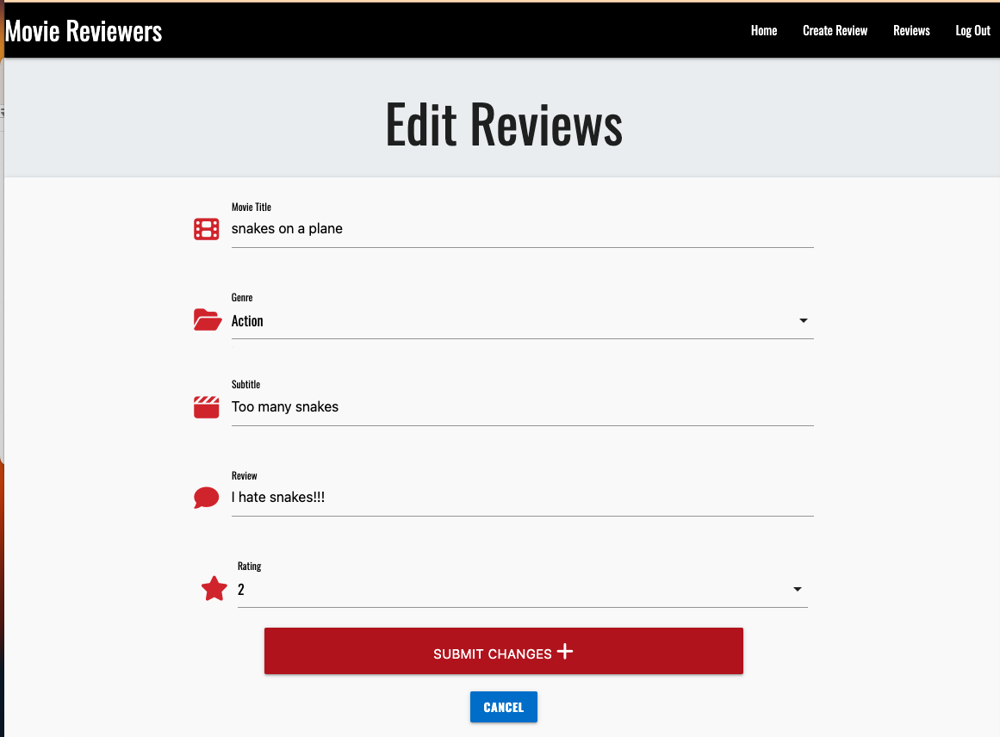
 

### Unauthorised Page

The unauthorised page has a very simple design, which consists of a heading and a link to redirect to the login page. This is used on pages that a user that is not logged in shouldn't be able to see, such as reviews page, create review and edit review. 

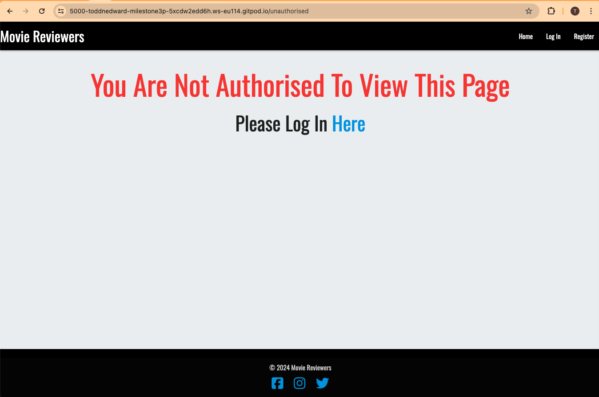
 

### Logout Navigation Link

When the user clicks on 'logout' provided in the navigation bar, the user is then logged out of their account and redirected back to the login page.

## **Future Enhancements**

For future improvements to the website, I would like to consider adding:

* Giving the user the option to change their password if they have forgotten their current one or would like to change for security/ memory purposes. 
This would be easier for the admin of the site also to be less time consumed of having to fix these password changes for the user if they have to contact
the admin.

* Adding a link from each review to either a seperate page to read a larger review left by the user, or to give a link for each movie, pulling the movie title name and showing the users
links to the corresponding movie on IMDB or rotten tomatoes to show further reviews and details. At the same time, this may be detrimental to the site in terms of traffic and keeping their users on the page by redirecting them to potentially competitive websites.

* Creating a profile section for the user where they can see their details and their reviews that they have created in a seperate environment to the reviews page which includes all reviews by all users.

## **Testing**

### **Responsiveness**

Responsiveness has been provided by Materialize using its S, M and L classes. CSS has also been added for mobile and tablet views for font sizes and background image layout. 
 
Responsiveness has been tested on Google Chrome, Safari and Firefox.
 
Devtools on Google Chrome has been used to test across all devices to make sure all instances are responsive.

### **Functionality**

 

#### Manual Testing as a LOGGED OUT/ NON REGISTERED user:

 

Feature/ Test                                  | Expected Outcome                                                                       | Result          |
| -------------------------------------------- | -------------------------------------------------------------------------------------- | --------------- |
| Nav Bar Layout                               | Can only view login, register and logout in nav bar                                    | Pass            |
| Nav Bar Logo                                 | Redirects to home page when clicked                                                    | Pass            |
| Nav Bar Home Link                            | When clicked, redirects to home page                                                   | Pass            |
| Nav Bar Login Link                           | When clicked, redirects to login page                                                  | Pass            |
| Nav Bar Register Link                        | When clicked, redirects to register page                                               | Pass            |
| Home page H1 and H2 headings                 | To be visible against background image                                                 | Pass            |
| Home page register button                    | When clicked, redirects to register page                                               | Pass            |
| Home page Example Reviews                    | 3 reviews are viewable from logged in reviews page                                     | Pass            |
| Footer social media links                    | All icons when clicked redirect to corresponding social media websites                 | Pass            |
| Login Page form                              | login form can be filled in with login details                                         | Pass            |
| Login Page form labels                       | login form input boxes show labels to explain to user what is expected for input       | Pass            |
| Login Page form required fields              | login form tells user boxes are required if not filled in correctly                    | Pass            |
| Login Page correct details                   | If login details submitted match database entry, redirected to reviews page            | Pass            |
| Login Page incorrect details                 | If login details submitted do not match database entry, flash message shows user information incorrect and redirected to login page to start process again                                        | Pass            |
| Register Page form                           | register form can be filled in with registration details                               | Pass            |
| Register Page form labels                    | Register form input boxes show labels to explain to user what is expected for input    | Pass            |
| Register Page form required fields           | register form tells user boxes are required if not filled in correctly                 | Pass            |
| Register Page correct details                | If registration details meet criteria and are unique, registration will be successful and user redirected to reviews page            | Pass            |
| Register Page incorrect details              | If registration details submitted do not meet criteria, boxes show message saying required or show needed criteria                                        | Pass            |
| Cannot search for logged in user urls        | if user that is not logged in searches for pages in url that are only available to logged in users, unauthorised page will show with redirect link to login page     | Pass            |

 

 

#### Manual Testing as a LOGGED IN/ REGISTERED user:

 

Feature/ Test                                  | Expected Outcome                                                                             | Result          |
| -------------------------------------------- | -------------------------------------------------------------------------------------------- | --------------- |
| Nav Bar Layout                               | Can view home, create review, reviews and logout in nav bar. login and register now hidden   | Pass            |
| Nav Bar Links                                | All links in navbar take user to corresponding pages                                         | Pass            |
| Nav Bar Logo                                 | Redirects to home page when clicked                                                          | Pass            |
| Reviews Page H1 and H2 heading               | Readable against background image                                                            | Pass            |
| Reviews Search Bar                           | Allows user to enter movie title or genre                                                    | Pass            |
| Reviews Search Bar label                     | Label shown to tell user to input genre or movie title                                       | Pass            |
| Reviews Search Bar Search Button             | When clicked, searches for desired criteria                                                  | Pass            |
| Reviews Search Bar Reset Button              | When clicked, redirects to reviews page again to refresh to original state                   | Pass            |
| Reviews Review Cards                         | user can view review cards, see movie title, subtitle, review, rating and submitters username| Pass            |
| Create Review Page form                      | create review form can be filled in with review details                                      | Pass            |
| Create Review Page form select options       | when clicking genre or rating options, dropdown menus appear with options to click           | Pass            |
| Create Review Page form required fields      | if not all inputs and options are filled, user is prompted to fill in to be able to submit   | Pass            |
| Create Review Page form submit               | if all fields are filled in and meet criteria, on clicking submit, users review will be submitted to reviews page and user redirected to reviews page   | Pass            |
| Edit Review redirect                    | Upon clicking edit button on reviews page's reviews cards, user is redirected to edit_review page      | Pass            |
| Edit Review Page form labels                 | edit review form boxes show prior submitted information of review so user doesn't have to start again  | Pass            |
| Edit Review Page form                        | edit review form can be filled in with amended review details                                          | Pass            |
| Edit Review Page form select options         | when clicking genre or rating options, dropdown menus appear with options to click                     | Pass            |
| Edit Review Page form required fields        | if a box has been emptied from original information and not refilled, user prompted to fill in information before submission allowed             | Pass            |
| Edit Review Page form submit                 | if all fields are filled in and meet criteria, on clicking submit, users review changes will be submitted to reviews page and user redirected to reviews page   | Pass            |
| Delete Review button                         | When delete button is clicked, review created by the user will be deleted from all reviews on reviews page. Redirected to reviews page      | Pass            |
| User created reviews                         | Only reviews created by the currently logged in user can be edited and deleted by them                 | Pass            |
| Admin permissions                            | On reviews page, admin can delete and edit all reviews, regardless of creator                          | Pass            |
| Logout Nav Bar Link                          | When logout link clicked, user will be logged out of account and redirected to home page              | Pass            |
| Footer social media links                    | All icons when clicked redirect to corresponding social media websites                 | Pass            |

 

### **Validators**

#### HTML Validator

HTML Validators all passed:

Home Page

 
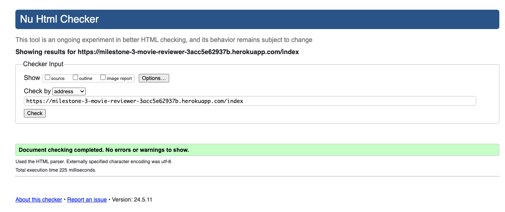

 

Login Page

 
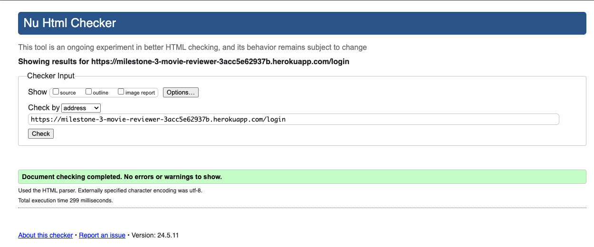

 

Register Page

 
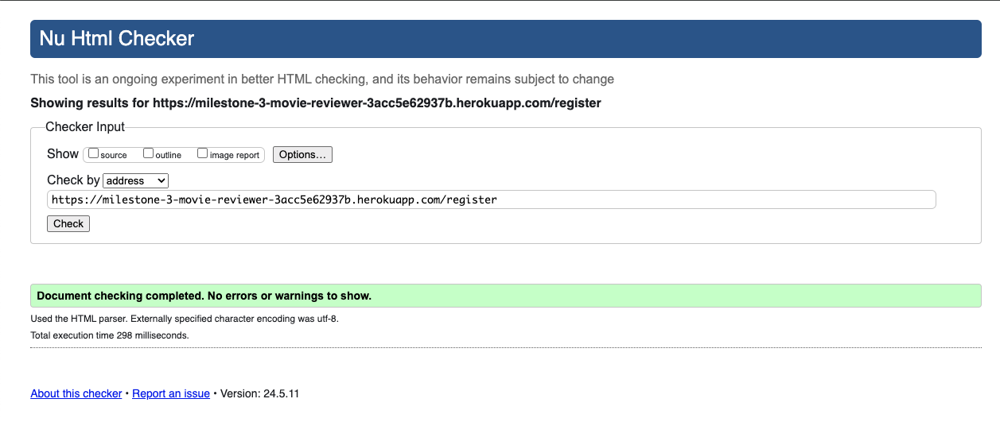

 

Reviews Page

 
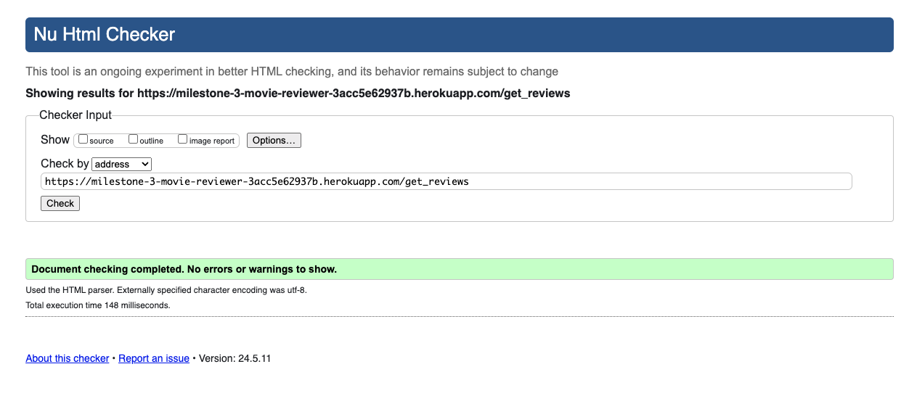

 

Create Review Page

 
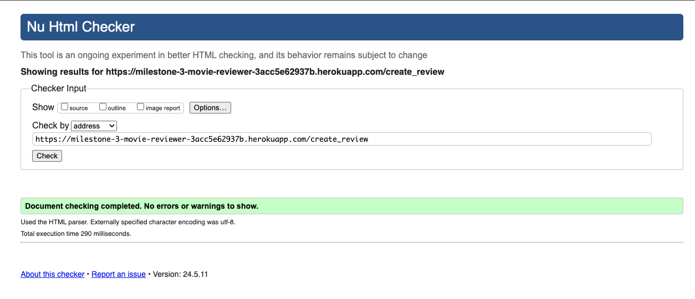

 

Edit Review Page

 
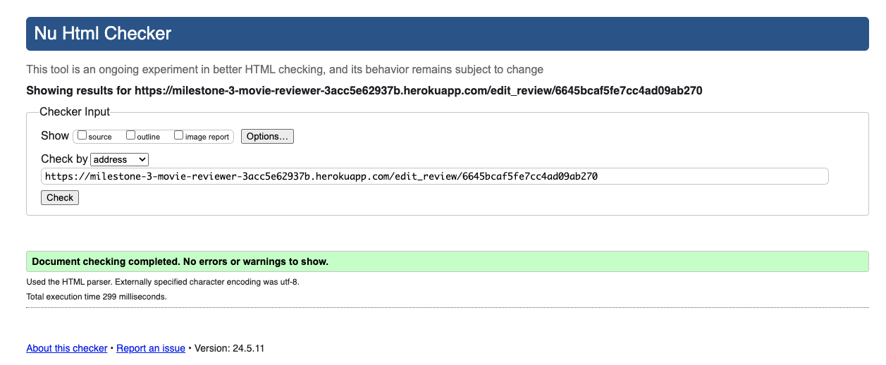

 

 

#### CSS Validator

CSS passed without any errors using the [CSS Validation service by W3.org](https://jigsaw.w3.org/css-validator/)

#### CI Python Linter

Python code validated with [Code Institute Python Linter](https://pep8ci.herokuapp.com/)
No errors found

### **Lighthouse**

Using google lighthouse, I check how my web application scored against performance, accessibility, best practice, and SEO. I downsized the main image used on index and reviews pages to lower loading time using the advice below. Lighthouse pointed that excess loading time was caused by jquery and materialize javascripts.

[Google image sizing advice](https://www.google.com/search?q=what+size+should+hero+image+be+for+website&sca_esv=8b3c2fe050857b40&rlz=1C5CHFA_enGB1022GB1024&ei=sPVNZtatNK7WhbIP_5C-8As&ved=0ahUKEwjWxceRsaGGAxUua0EAHX-ID74Q4dUDCBA&uact=5&oq=what+size+should+hero+image+be+for+website&gs_lp=Egxnd3Mtd2l6LXNlcnAiKndoYXQgc2l6ZSBzaG91bGQgaGVybyBpbWFnZSBiZSBmb3Igd2Vic2l0ZTIIECEYoAEYwwRI0xhQrwdYvBdwAXgBkAEAmAGhAaAB5weqAQM3LjO4AQPIAQD4AQGYAgigAvsEwgIKEAAYsAMY1gQYR8ICChAhGKABGMMEGAqYAwCIBgGQBgiSBwM3LjGgB-Uw&sclient=gws-wiz-serp)

#### Desktop View Results

Home Page

 
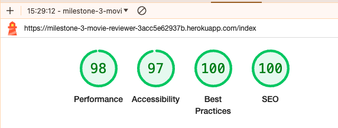

 

Login Page

 
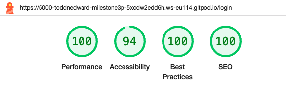

 

Register Page

 
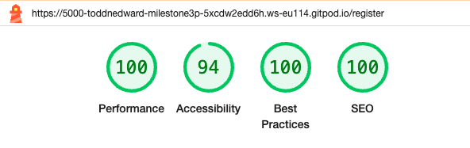

 

Reviews Page

 
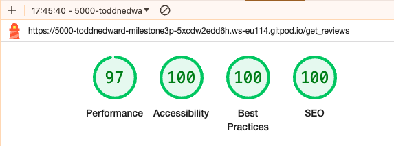

 

Create Review Page

 
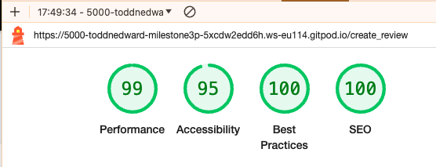

 

Edit Review Page

 
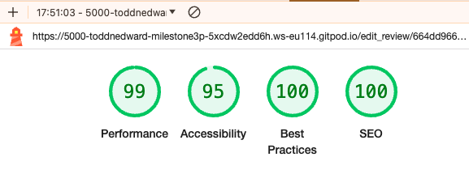

 

#### Mobile View Results

Home Page

 
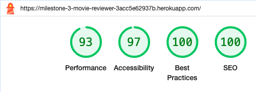

 

Login Page

 
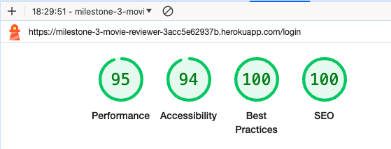

 

Register Page

 
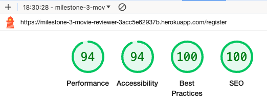

 

Reviews Page

 
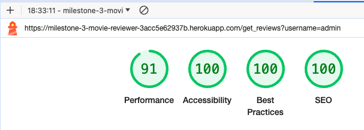

 

Create Review Page

 
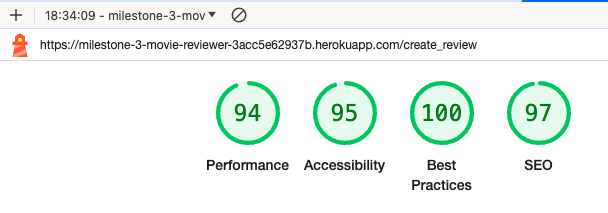

 

Edit Review Page

 
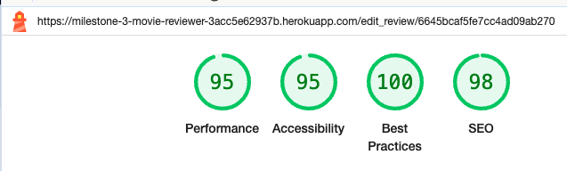

 

### **Testing User Stories**

**User Story 1**: As a user I want the site to be easy to use 
**Achieved?**: Yes. The site is a simple layout, with all main needs for links in the nav bar. Register button provided on home page also which is hidden once user is logged in to not cause confusion. No links are hidden through other page, but provided exactly when needed for the user. All form boxes are labelled.

**User Story 2**: As a user I want be able create an account 
**Achieved?**: Yes. The user clicks on register in either the nav bar, or on the register button provided in first view on the home page. Once clicked, a form is provided just requiring username and password. If the details are unique, the user clicks the submit button and is now a registered user.

**User Story 3**: As a user I want to be able to log in 
**Achieved?**: Yes. User simply clicks on the login link in the nav bar. once clicked they are redirected to the login page, where a form is provided. if their username and password details match an already registered account, they will be logged in and redirected to the reviews page.

**User Story 4**: As a user I want to be able to read reviews 
**Achieved?**: Yes. Once logged in, the user is redirected straight to the reviews page to also save confusion and the user being brought to this page. The reviews link is also displayed in the nav bar once the user is logged in.

**User Story 5**: As a user I want to be able to search through reviews easily 
**Achieved?**: Yes. A search bar is provided on the reviews page which allows the user to search for the categories movie title or genre. This will filter the results for them and show the desired criteria.

**User Story 6**: As a user I want to be able to create a review 
**Achieved?**: Yes. Once a user is logged in, they can click on create review in the nav bar. This will redirect the user to the create review page which is a form. The user can fill out the form and submit. Once submitted, the review will be added to the reviews page and the user will automatically be redirected back to the reviews page and be able to see their review added.

**User Story 7**: As a user I want to be able to delete a review 
**Achieved?**: Yes. Once a user has created a review, a button will be displayed on the review they have created titled 'edit'. The user clicks on the button and is redirected to the edit review page. The form will be prefilled with the information previously given for the review so the user can amend the information. If they are happy with the changes they have made, they click on 'submit changes'. Changes will be saved and the user will be redirected to the reviews page. If the user changes their mind about making amendments once they have clicked on edit, they can click the cancel button at the bottom of the form and will be redirected back to the reviews page without edits being made.

**User Story 8**: As a user I want to be able to log out of my account 
**Achieved?**: Yes. The user clicks on logout from the navbar menu, where they will be logged out from their account and redirected to the home page.

## **Bugs**

During the development process, I found the following bugs:

#### Unable to run the project via IDE

I was unable to run my project via IDE. After trying to find a solution, I asked for support from code institute, which Sarah helped me solve. The problem was because of a typo in the coding for the mongo URI, once corrected app.py ran perfectly/

#### .remove python command not working

I was trying to get the .remove coding to work my delete review functionality. I tried in different ways such as .remove, .remove_one, .delete and .delete_one but the problem still persisted. In the end, thanks to the slack community, I found this forum page: [slack community .remove chat](https://app.slack.com/client/T0L30B202/search?recommended_build_version=1716411153&build_manifest_last_modified=1716414633) and the advice given by Thomas McQuillan, I found it was a problem with pymongo. I uninstalled pymongo and reinstalled pymongo as suggested but the problem still persisted. I tried different versions until I finally tried pymongo version 3.11. This worked perfectly, and i updated the requirements.txt accordingly. This fixed the problem and now all python functions work.

#### Edit review information not being pulled from mongo DB

I had an issue where the information I wanted to retrieve from a previous review was not being displayed. The problem was caused by a typo by adding an s to review, so when i was searching for 'for review in reviews' I was still searching outside the parameters rather than simply searching for 'review' in the results. After changing the typo, the information was retrieved.

#### Select option on create review and edit review forms we're allowing user to submit form whilst no option was chosen

On the create review and edit review forms, even after putting the required attribute in the tag, it was allowing the user to submit the form whilst leaving the select option boxes for genre and movie title blank. After trying several options like adding required="required" and changing disabled status in tags, the problem persisted. I went to back to the mini project example in code institute and restudied the select options videos and discovered it was a lack of coding in javascript for materialize that caused the issue. Once the code was added, the functionality ran perfectly.

#### CSS code being ignored for background image sizing

CSS was ignoring code that was added for background images, mainly for sizing. Materialize was causing issues and changing the size. Once I added !important to the attributes I wanted that weren't working, this fixed the issue and background images sized as we're instructed in style.css.

## **Deployment**

This project was deployed from Gitpod IDE to Heroku and the Pymongo database to Mongo DB. Heroku is a cloud platform that allows
developers to run and operate applications in the cloud.

To deploy the site using Heroku:

1. Login (or signup) to [Heroku](https://www.heroku.com/).
2. From the dashboard, create a new app by selecting "New" -> "Create new app."
3. Give your app a name (must be unique) and select the region closest to your location.
4. Once the app is created, connect your app to your GitHub repository:
    - Go to the "Deploy" tab in your Heroku dashboard.
    - Select "GitHub" as the deployment method.
    - Connect to GitHub by entering your GitHub account credentials.
    - Search for the repository name and click "Connect".
5. Configure environment variables under "Settings" -> "Reveal Config Vars". Set keys like `SECRET_KEY`, `DATABASE_URL`, etc.
6. Go back to the "Deploy" tab and scroll down to "Manual deploy".
    - Choose the branch you want to deploy (usually "main" or "master").
    - Click "Deploy Branch".
7. After deployment, Heroku will give you a URL to access your deployed application.
8. Click on "Open app" in the top right of the dashboard to view your deployed site.

### Local Development

#### `How to Fork`

To fork the repository:

1. Log in (or sign up) to GitHub.
2. Navigate to the repository for this project on GitHub.
3. Click the "Fork" button in the top-right corner of the page.

#### `How to Clone`

To clone the repository:

1. Log in (or sign up) to GitHub.
2. Navigate to the repository for this project on GitHub.
3. Click on the "Code" button, then choose to clone via HTTPS, SSH, or GitHub CLI, and copy the URL provided.
4. Open your terminal.
5. Change the current working directory to the location where you want the cloned directory.
6. Type `git clone`, then paste the URL you copied earlier.
7. Press Enter to create your local clone.

 

## **Tech**

The following languages we're used for my project:

* HTML
* CSS (Including Materialize CSS)
* Python
* Javascript

Frameworks and tools used:

* MongoDB
* Flask
* JQuery
* Materialize
* Font Awesome
* Google Fonts
* Github
* Gitpod
* Heroku 

 

## **Credits**

### **Mentions**

Special thanks to Martina Terlevic my mentor for her help and expert advice on perfecting my project and helping me some issues that I had. Also a special thanks to Sarah on code institute live support for helping with mongo db connection issues that I had.

### **Content**

 

[Materialize documentation](https://materializecss.com/) for providing templates and css.

[The slack community](https://app.slack.com/client/T0L30B202/C7JQY2RHC?recommended_build_version=1716411153&build_manifest_last_modified=1716414633) for issues with database connection and fixing the python .remove issue by downgrading to pymongo 3.11.

[Stack Overflow](https://stackoverflow.com/) used for select tags required option formatting. 

Also used for the google lighthouse advice that "Links do not have a discernible name". I followed their advice [here](https://stackoverflow.com/questions/51683761/how-to-fix-lighthouse-links-do-not-have-a-discernible-name) for adding an aria label which fixed the issue.

[W3 Schools](https://www.w3schools.com/css/css_rwd_mediaqueries.asp) for media query sizing advice.

[dev.to](https://dev.to/nehalahmadkhan/how-to-make-footer-stick-to-bottom-of-web-page-3i14) to fix footer not sticking to the bottom of page.

[W3 Schools](https://www.w3schools.com/html/html_favicon.asp) for adding favicon to web application.

device mockup created at [www.techsini.com](https://techsini.com/multi-mockup/index.php)

Workflow diagram created at [canva.com](https://canva.com)

### **Media**

Background image was downloaded from [pexels.com](www.pexels.com). See the original link to the image used [here](https://www.pexels.com/photo/people-sitting-on-red-chairs-7991158/)

Favicon created at [Favicon.io](https://favicon.io/emoji-favicons/performing-arts)