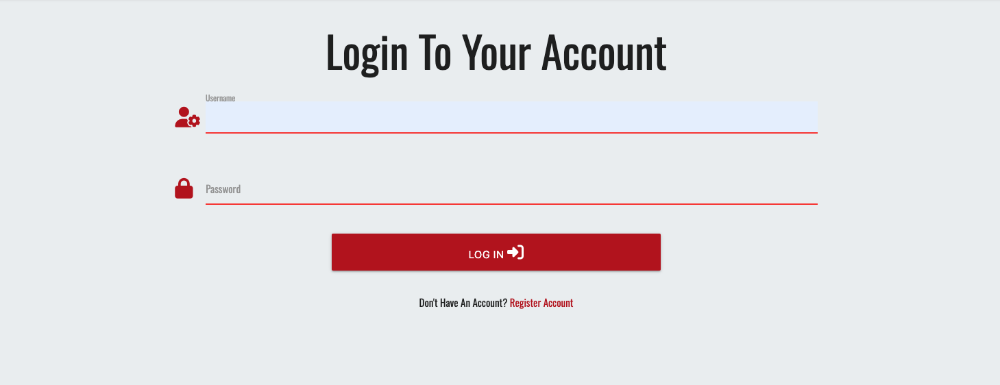

# **Movie Reviewers**

[View deployed project here](https://milestone-3-movie-reviewer-3acc5e62937b.herokuapp.com/)

## **Site Overview**

Movie Reviewers is an online application for movie fans and critiques to read post reviews of movies that they have watched to share with other people. Users can only see examples of the reviews until they login or register. Once logged in and registered, users can create, edit and delete their own reviews, as well search through reviews of other movies that they may have watched or want to watch and find an opinion on.

## **Table of contents**

- [**Movie Reviewers**](#movie-reviewers)
- [**Site Overview**](#site-overview)
- [**Planning Stage**](#planning-stage)
  - [**Target Audiences**](#target-audiences)
  - [**User Stories**](#user-stories)
  - [**Site Aims**](#site-aims)
  - [**User Goals**](#user-goals)
  - [**Wireframes**](#wireframes)
    - [**Desktop View**](#desktop-wireframe)
    - [**Mobile View**](#phone-wireframe)
  - [**Color Scheme**](#color-scheme)
  - [**Flowcharts**](#flowcharts)
- [**Typography**](#typography)
- [**Features**](#features)
- [**Future Enhancements**](#future-enhancements)
- [**Testing**](#testing)
  - [**Responsiveness**](#responsiveness)
  - [**Functionality**](#functionality)
  - [**Validators**](#validators)
  - [**Lighthouse**](#lighthouse)
  - [**Testing user stories**](#testing-user-stories)
- [**Bugs**](#bugs)
- [**Deployment**](#deployment)
- [**Tech**](#tech)
- [**Credits**](#credits)
  - [**Mentions**](#mentions)
  - [**Content**](#content)
  - [**Media**](#media)

## **Planning Stage**

### **Target Audiences**

* Users that enjoy movies
* Users that would like to discuss new and old movies and share their opinons
* Users looking for inspiration for new movies to watch from other user's reviews

### **User Stories**

* As a user, I want it to be user friendly and easy for me to use
* As a user, I want to be able to see text clearly and know the purpose of the site straight away from its title and subtitle
* As a user, I want the site to be responsive on all devices
* As a user, I want to be able to create an account
* As a user, I want to be able to log in to my account once created
* As a user, I want to be able to see all reviews that exist once I have logged in
* As a user, I want to be able to create a review and navigate to it easily within the navigation area
* As a user, I want to be able to edit my reviews if I've changed my opinion and made a typo and wish to amend it
* As a user, I want to be able delete reviews that I have created

* As admin, I want to be able to login to my admin account
* As admin, I want to be able to edit and delete all reviews from the reviews section regardless of who has created them

### **Site Aims**

* Have a simple to use application where the users can create, read, edit and delete movie reviews.
* Let users be able to easily register and account, and once complete be able to log in to their account.
* Once users have logged in, allow them create, edit and delete their own movie reviews.
* Once logged in, allow all users to see all reviews, including reviews created by other users.
* To allow the user to search through all reviews quickly and easily.

### **User Goals**

#### First Time User Goals

As a first time user, I want to be able to go to the home page and see what the site is for and its purpose quickly through imagery and the headings 
used to explain what the website does. 
 
I want to able to find how to create an account quickly and easily and not have to search to find that as an option. I want the links to be accessible and see them quickly.
 
I want to be able to create an account. I want the details to be unique to me and for the process to be simple, asking for no more details than asking for a username and password.
 
Once my account is created, I want to be able to view all pages that are accessible to me, to be able to create, edit and delete reviews, to be able to read 
all reviews and be able to log out from my account.

#### Returning User Goals

As a returning user I want to be able to log in easily using the details I had previously submitted when signing up to the website.
 
Once logged in to my account, I want to be able to create, edit and delete reviews, to be able to read 
all reviews and be able to log out from my account.

#### Admin User Goals

As admin, I want to be able to login with the admin credentials I have provided.
 
Once logged, I want to be able to read all reviews, delete or edit any reviews on the page, regardless of their creators. I also want to be able to create reviews, and to logout from my account.

### **Wireframes**

#### **Desktop View**

Home Page

 

 

Reviews Page

 

 

Create Review Page

 

 

Edit Review Page

 

 

Register Page

 

 

Login Page

 

 

#### **Mobile View**

Home Page

 

 

Reviews Page

 

 

Create Review Page

 

 

Edit Review Page

 

 

Register Page

 

 

Login Page

 

 

### **Flowcharts**

To visualise the journey of a user for the website, I have created flowcharts to show their process of navigation through the website. This includes logging into the website, registering an account, editing a review, deleting a review, cancelling the process of editing a review and logging out. These are all the main processes of the web application. Admin users follow the exact same process as other users but have permissions to also delete and edit any review rather than just ones created to the specific user.

#### Home Page Flow

This shows user's journey from the home page to further actions such as logging in or creating an account by registering.

#### Create/ Edit Review Flow

This shows the user's journey once they have logged in and are redirected to the reviews page, and shows the process of how they can create a review. Once they've created a review, it also shows the process of how they can edit that review also. Admin has permissions to edit any review so doesn't need to follow the create review process to begin with, but also has permissions to create a review like any other user.

#### Delete Review Flow

This shows the user's journey once they have created a review on how to delete it. Again, admin has permission to delete any review that exists on the page, regardless of its creator.

#### Logout Page Flow

This shows the user's journey of logging out from their account if they are signed in.

### **Color Scheme**

The color scheme has been mainly provided by Materialize CSS:
[Materialize CSS options](https://materializecss.com/color.html)

The main color schemes used are:

Navigation bar: black (provided by materialize CSS) 
Footer: black (provided by materialize CSS) 
Body background: #eceff1 (Hex color code, off white) 
H1 text when against background images (Home/index page and Reviews Page): amber-text text-lighten-2 (provided by materialize CSS) 
Review cards (Home/index page and Reviews Page): blue darken-1 (provided by materialize CSS)

The colours I chose we're to keep the design simple, but also similar colours used in cinemas, such as royal blue, gold and red which is provided by the main background image. 
[See background image here](static/images/background-image-cropped.jpg)

I used [WCAG Color Contrast Checker](https://accessibleweb.com/color-contrast-checker/) to make sure my text and background colors met the contrast standards. I changed the reviews cards colors to a lighter blue (they we're originally blue darken-4, now blue darken-1) and also changed all text within the review cards to black as the amber color for the movie title did not meet the standards and failed. All tests passed under the changes.

## **Typography**

I decided to use the oswald font family from google as I had searched for different cinema fonts on google and this seemed to look the best and makes the text stand out well also against background images and colours.  

[https://fonts.google.com/specimen/Oswald](https://fonts.google.com/specimen/Oswald)

## **Features**

### Features that are shown on all pages

#### Navigation Bar

All pages of the web application feature the navigation bar. When the user is not logged in to the site, they are shown the links 'Home', 'Login' and 'Register'. Once logged in, the user no longer needs to see login or register, so these are hidden and instead the options become 'Home', 'Create Review', 'Reviews' and 'Logout'. If you click on the logo in the left hand corner, this will also redirect you back to the home page (index).
Mobile view becomes a hamburger dropdown menu which opens from the left hand side showing the same options.

##### Navigation Bar - Computer View

##### Navigation Bar - Mobile View

#### Footer

All pages feature the footer section, which sticks to the bottom, so it shows no spaces and remains at the bottom of the page on all devices. This shows the copyright for movie reviewers. The year date uses javascript so the year is automatically updated each year.
The footer also features social media links, which include Facebook, Instagram and Twitter (X). These all open a new page to not take the user away from the current site if they click on them. These links take the user to the corresponding social media platform. On hover, the colour of the icons change from blue to red to make it more obvious to the user that they can click on them.

#### Flash Messages

All pages show flash messages if changes are made. They are displayed at the top of the page underneath the navigation bar so they are seen easily by the user. They show the user when changes have been made of any kind, including showing Hi! (username), successful registry, review created, review edited, review deleted and successfully logged out of account. The text colour is red to make the text stand out more to the user so they're aware a change has taken place.

### Home Page

The Home Page features a H1 and H2 header welcoming the user to the site. This has a background image behind it showing people at the cinema to make it more clear to the user that the intention of the site is for movies and people that enjoy movies. Wihin the background image, it also includes a button that asks the user to register to make this option more obvious than it just being in the navigation bar. This is especially helpful for mobile users as the option is put right in front of them as soon as they visit the page, rather than having to click on the navigation bar to see the options. 

Home Page Mobile View Welcome Section

 

 

The home page also displays 3 reviews which are pulled from the mongo DB database. This is to help the user understand what to expect from the site better if they register and want to read more reviews or create their own. 

Home Page Example Reviews Section

 

 

### Login Page

The login page is a simple design, which displays a H1 header asking the user to log in to the website. It features a form text box for username and a form text box for password. Each form box features an icon. A person with a cog is shown for username helping it appear more obvious to the user for its purpose. The password shows a padlock icon which again makes it more obvious to the user it is for a password section. Labels are also used to show the text 'username' and 'password' within the boxes. A submit button is provided labelled 'log in' with an enter door icon. The submit button is red to stay within the design, and match the red theme that the background image on index and reviews page have, and also the flash text font color, and when hovering over the social media icons in the footer. It also has text and a link at the bottom 'Don't Have An Account? Register Account' which makes it easier for the user if they don't yet have an account, to be taken to the appropriate page quickly rather than having to search on the navigation bar, especially if a mobile user to save the user having to click on the navigation icon to find the option.

Login Page

 

 

### Register Page

The register page has the same design as the login page, using the same layout and sizings. Again, it shows the same icons for username and password, with the same labels, showing 'username' and 'password' for the appropriate boxes. The submit button now displays 'register account' with the same enter door icon as the login submit button. Underneath the submit button, the text and link displays 'Have An Account? Log In' to take the user to the appropriate page if they are already registered. This again saves mobile users having to try find the option by clicking on the navigation and makes navigation easier for the user.

Register Page

 

 

### Reviews Page

The reviews page features H1 heading and H2 subheading to tell the user they are on the reviews page and the intent of the page. These are displayed in the same background image as the index page. I tried different images, but I liked it remaining the same as the picture perfectly shows what the website is about. The text is also in its own box which has a darker transparency. This is to help the contrast of the text against the image and make it clearer for the user.
 
Underneath the heading, a search bar is displayed. This allows users to filter through the movies by movie title and genre to improve their experience and speed up their search of looking for movies. This includes a search button which is blue to stay with the theme of the review cards, and a red reset button which allows users to reset their search to show all results again. The choice of red also matches the flash message text, the social media hovered icons and is similar to the main colours of the background image. The search bar also includes the label 'Search By Movie Title Or Genre' so the user knows which parameters they can search within.

Reviews Page - Search Bar

 

 

Reviews are also displayed underneath the search bar, which uses materialize card panel for design. These are blue to stay with the theme, and are the same design as the example reviews shown on the home page. 
 
The review panels display: Movie Title, Genre, Subtitle, Review, Rating and Username. This displays all details the user may want to know about a movie they want to know more about. 

Reviews Page - Review Cards

 

 

### Create Review Page

The create review page is a simple design which includes a submit form. The categories for the submit form are: Movie Title, Genre, Subtitle, Review and Rating. This allows the user to leave all necessary information to review a movie. The genre and rating options are both select menus that list different genres in the genre box, and numbers from 1 to 5 in the ratings section. Each category has corresponding icons to make the options more obvious to the users, as well as labels in each box to tell the user what is expected in each box. These include a movie reel for the movie title, a folder icon for the genre as its a category, a film clap board for the subtitle, a speech bubble for the review as this is the users main opinion box, and a star icon for the ratings box. These are all displayed in the same red as the buttons used across the website to stay with the theme. The submit button shows the text 'submit review' with a plus icon showing the user the review will be added to the already existing reviews. This submit box is also shown in red as the other buttons used on the reviews search bar reset button, login button, register button, and register button shown on home page.

Create Review Page

 

 

### Edit Review Page

The edit review page has the same design as the create review page. This is because its using the same information as before, but simply amending any information on the page that may need changing by the user. It has the same layout and options as the create review page. The only difference it displays is displaying the text that was from the already created review that needs editing, so the user can see what needs editing and can leave what doesn't need editing so they don't have to start again with all information. The only other change from the create page is that the submit button now shows the text 'submit changes'. Underneath the submit changes, there is a cancel button. The button is blue (matching style of search button and social media icons) titled 'cancel' which allows the user to cancel any changes to their amended review if they change their mind, and redirects them back to the get_reviews page.

ADD IMAGE!!!!!!!!

<!-- 

Create Review Page

 

 

 -->

### Logout Navigation Link

When the user clicks on 'logout' provided in the navigation bar, the user is then logged out of their account and redirected back to the login page.

## **Future Enhancements**

For future improvements to the website, I would like to consider adding:

* Giving the user the option to change their password if they have forgotten their current one or would like to change for security/ memory purposes. 
This would be easier for the admin of the site also to be less time consumed of having to fix these password changes for the user if they have to contact
the admin.

* Adding a modal to the delete review sections to ask the user if they are sure that they would like to delete their review. This would confirm their action and save
any accidental or unnecessary deletions. This would be especially helpful as a precaution for the admin who has the option to delete any reviews that they want to.

* Adding a link from each review to either a seperate page to read a larger review left by the user, or to give a link for each movie, pulling the movie title name and showing the users
links to the corresponding movie on IMDB or rotten tomatoes to show further reviews and details. At the same time, this may be detrimental to the site in terms of traffic and keeping their users on the page by redirecting them to potentially competitive websites.

## **Testing**

### **Responsiveness**

Responsiveness has been provided by Materialize using its S, M and L classes. CSS has also been added for mobile and tablet views for font sizes and background image layout. 
 
Responsiveness has been tested on Google Chrome, Safari and Firefox.
 
Devtools on Google Chrome has been used to test across all devices to make sure all instances are responsive.

### **Functionality**

### **Validators**

#### HTML Validator

#### CSS Validator

#### CI Python Linter

Python code validated with [Code Institute Python Linter](https://pep8ci.herokuapp.com/)
No errors found

CSS passed without any errors using the [CSS Validation service by W3.org](https://jigsaw.w3.org/css-validator/)

### **Lighthouse**

Using google lighthouse, I check how my web application scored against performance, accessibility, best practice, and SEO. I downsized the main image used on index and reviews pages to lower loading time using the advice below. Lighthouse pointed that excess loading time was caused by jquery and materialize javascripts.

[Google image sizing advice](https://www.google.com/search?q=what+size+should+hero+image+be+for+website&sca_esv=8b3c2fe050857b40&rlz=1C5CHFA_enGB1022GB1024&ei=sPVNZtatNK7WhbIP_5C-8As&ved=0ahUKEwjWxceRsaGGAxUua0EAHX-ID74Q4dUDCBA&uact=5&oq=what+size+should+hero+image+be+for+website&gs_lp=Egxnd3Mtd2l6LXNlcnAiKndoYXQgc2l6ZSBzaG91bGQgaGVybyBpbWFnZSBiZSBmb3Igd2Vic2l0ZTIIECEYoAEYwwRI0xhQrwdYvBdwAXgBkAEAmAGhAaAB5weqAQM3LjO4AQPIAQD4AQGYAgigAvsEwgIKEAAYsAMY1gQYR8ICChAhGKABGMMEGAqYAwCIBgGQBgiSBwM3LjGgB-Uw&sclient=gws-wiz-serp)

#### Desktop View Results

Home Page

 

 

Login Page

 

 

Register Page

 

 

Reviews Page

 

 

Create Review Page

 

 

Edit Review Page

 

 

#### Mobile View Results

Home Page

 

 

Login Page

 

 

Register Page

 

 

Reviews Page

 

 

Create Review Page

 

 

Edit Review Page

 

 

### **Testing User Stories**

## **Bugs**

## **Deployment**

## **Tech**

## **Credits**

### **Mentions**

### **Content**

### **Media**

thanks to Sarah for helping with mongo db connection issues I had

device mockup created with: https://techsini.com/multi-mockup/index.php