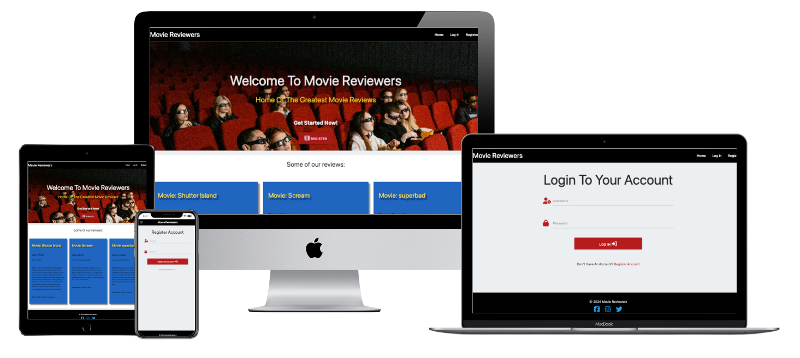

# **Movie Reviewers

[View deployed project here](https://milestone-3-movie-reviewer-3acc5e62937b.herokuapp.com/)

## **Site Overview**

Movie Reviewers is an online application for movie fans and critiques to read post reviews of movies that they have watched to share with other people. Users can only see examples of the reviews until they login or register. Once logged in and registered, users can create, edit and delete their own reviews, as well search through reviews of other movies that they may have watched or want to watch and find an opinion on.

## **Table of contents**

- [**Movie Reviewers**](#movie-reviewers)
- [**Site Overview**](#site-overview)
- [**Planning Stage**](#planning-stage)
  - [**Target Audiences**](#target-audiences)
  - [**User Stories**](#user-stories)
  - [**Site Aims**](#site-aims)
  - [**Wireframes**](#wireframes)
    - [**Desktop View**](#desktop-wireframe)
    - [**Mobile View**](#phone-wireframe)
  - [**Color Scheme**](#color-scheme)
- [**Typography**](#typography)
- [**Features**](#features)
- [**Future Enhancements**](#future-enhancements)
- [**Testing Phase**](#testing-phase)
  - [**Responsiveness**](#responsiveness)
  - [**Functionality**](#functionality)
  - [**Validators**](#validators)
  - [**Lighthouse**](#lighthouse)
  - [**Testing user stories**](#testing-user-stories)
- [**Bugs**](#bugs)
- [**Deployment**](#deployment)
- [**Tech**](#tech)
- [**Credits**](#credits)
  - [**Honourable mentions**](#honourable-mentions)
  - [**Content**](#content)
  - [**Media**](#media)

## **Planning Stage**

### **Target Audiences**

* Users that enjoy movies
* Users that would like to discuss new and old movies and share their opinons
* Users looking for inspiration for new movies to watch from other user's reviews

### **User Stories**

* As a user, I want it to be user friendly and easy for me to use
* As a user, I want to be able to see text clearly and know the purpose of the site straight away from its title and subtitle
* As a user, I want the site to be responsive on all devices
* As a user, I want to be able to create an account
* As a user, I want to be able to log in to my account once created
* As a user, I want to be able to see all reviews that exist once I have logged in
* As a user, I want to be able to create a review and navigate to it easily within the navigation area
* As a user, I want to be able to edit my reviews if I've changed my opinion and made a typo and wish to amend it
* As a user, I want to be able delete reviews that I have created

* As admin, I want to be able to login to my admin account
* As admin, I want to be able to edit and delete all reviews from the reviews section regardless of who has created them

### **Site Aims**

* Have a simple to use application where the users can create, read, edit and delete movie reviews.
* Let users be able to easily register and account, and once complete be able to log in to their account.
* Once users have logged in, allow them create, edit and delete their own movie reviews.
* Once logged in, allow all users to see all reviews, including reviews created by other users.
* To allow the user to search through all reviews quickly and easily.

### **Wireframes**

#### **Desktop View**

Home Page

 

 

Reviews Page

 

 

Create Review Page

 

 

Edit Review Page

 

 

Register Page

 

 

Login Page

 

 

#### **Mobile View**

Home Page

 

 

Reviews Page

 

 

Create Review Page

 

 

Edit Review Page

 

 

Register Page

 

 

Login Page

 

 

### **Color Scheme**

The color scheme has been mainly provided by Materialize CSS:
[Materialize CSS options](https://materializecss.com/color.html)

The main color schemes used are:

Navigation bar: black (provided by materialize CSS) 
Footer: black (provided by materialize CSS) 
Body background: #eceff1 (Hex color code, off white) 
H1 text when against background images (Home/index page and Reviews Page): amber-text text-lighten-2 (provided by materialize CSS) 
Review cards (Home/index page and Reviews Page): blue darken-1 (provided by materialize CSS)

The colours I chose we're to keep the design simple, but also similar colours used in cinemas, such as royal blue, gold and red which is provided by the main background image. 
[See background image here](static/images/background-image-cropped.jpg)

## ** Typography **

I decided to use the oswald font family from google as I had searched for different cinema fonts on google and this seemed to look the best and makes the text stand out well also against background images and colours.  

[https://fonts.google.com/specimen/Oswald](https://fonts.google.com/specimen/Oswald)

thanks to Sarah for helping with mongo db connection issues I had

device mockup created with: https://techsini.com/multi-mockup/index.php